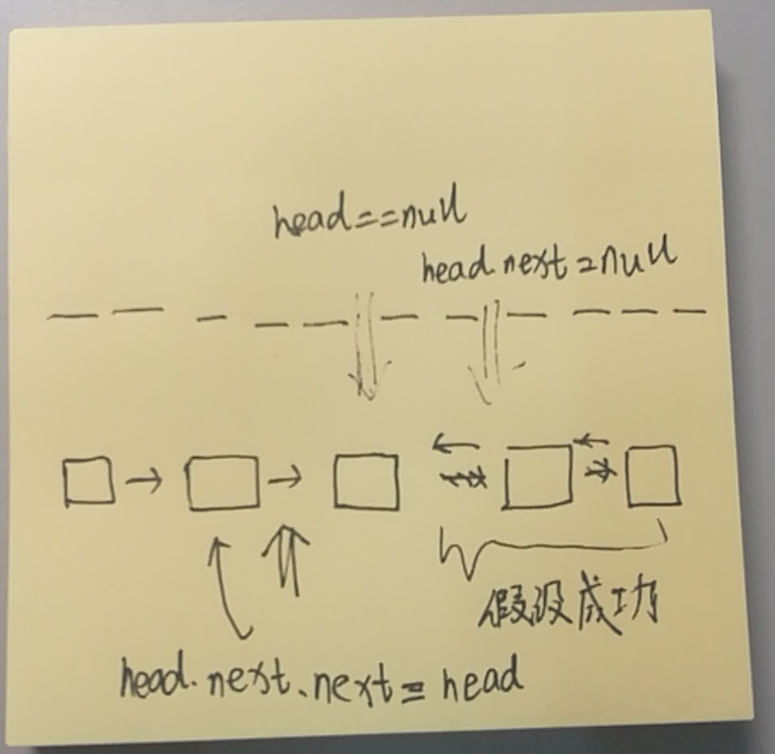

Reverse a singly linked list.

## 1. Example:

```
Input: 1->2->3->4->5->NULL
Output: 5->4->3->2->1->NULL
```

## 2. Follow up:

A linked list can be reversed either iteratively or recursively. Could you implement both?

## 3. Solution 1

- 自己的实现版本（迭代 Iterative）

```java
/**
 * Definition for singly-linked list.
 * public class ListNode {
 *     int val;
 *     ListNode next;
 *     ListNode(int x) { val = x; }
 * }
 */
class Solution {
    public ListNode reverseList(ListNode head) {
        //边界特殊分析
        if(head == null){
            return head;
        }

        /**
        * 肯定是要用到三个指针的，因为你首先head要指向向前的一个结点，同时，
        * 你还的保留下一个结点的指针，这样子才不会使链表断开。
        *
        * 但是，其实这里，主要还是head指针和pre指针的操作，
        * tempNext指针只是暂时保留下一个结点的位置信息而已。
        */
        ListNode pre = null;
        while(head != null){
            ListNode tempNext = head.next;
            head.next = pre;
            pre = head;
            head = tempNext;
        }
        head = pre;

        //做题时忘记加：缺少return
        return head;
    }
}
```

### Analysis 2

- Time complexity: `O(n)`. Assume that `n` is the list's length, the time complexity is `O(n)`.

- Space complexity: `O(1)`.

## 3. Solution 2

- 别人的解法：使用递归。

The recursive version is slightly trickier and the key is to **work backwards**.   

Assume that the rest of the list had alreadly been reversed, now how do I reverse the front part? Let's assume the list is: n1 → … → nk-1 → nk → nk+1 → … → nm → Ø

Assume from node nk+1 to nm had been reversed and you are at node nk.

n1 → … → nk-1 → `nk` → nk+1 ← … ← nm

We want nk+1’s next node to point to nk.

So,

nk.next.next = nk;

Be very careful that n1's next must point to Ø. If you forget about this, your linked list has a cycle in it. This bug could be caught if you test your code with a linked list of size 2.



```java
/**
 * Definition for singly-linked list.
 * public class ListNode {
 *     int val;
 *     ListNode next;
 *     ListNode(int x) { val = x; }
 * }
 */
class Solution {
    public ListNode reverseList(ListNode head) {
        //终止条件要写在递归的前面
        if(head == null || head.next == null){
            return head;
        }
        /*
        * 递归，连续压栈；操作的是当前的栈，
        * 这里的p返回的永远是前面终止条件的最后一个head/null
        */
        ListNode p = reverseList(head.next);
        //反转的关键
        head.next.next = head;
        //处理第一个边界值的关键
        head.next = null;
        //返回链表
        return p;
    }
}
```

### Analysis 2

- Time complexity: O(n).
- Space complexity: O(n).
